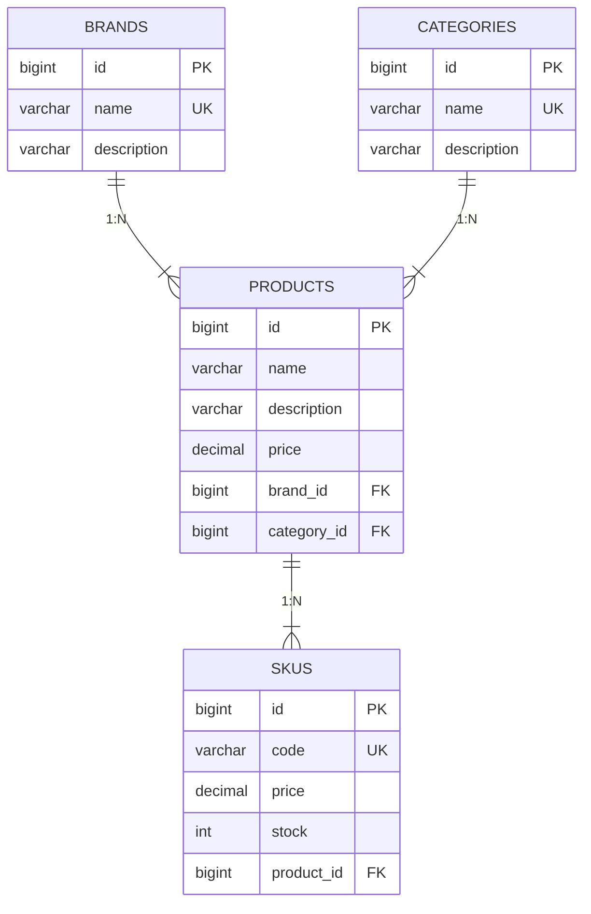

# Product Catalog API

API REST para gerenciamento de catálogo de produtos desenvolvida com Java, Spring Boot e MySQL.

**Projeto totalmente comentado em português.** Todos os arquivos Java possuem documentação completa com Javadoc, incluindo explicações de cada classe, método, atributo e anotação. Ideal para estudo e aprendizado de Spring Boot.

---

> Badge YOLO: Merge sem review

## Versão

| Versão | Data | Descrição |
|--------|------|-----------|
| `1.1.0` | 01/09/2026 | Adicionado suporte a paginação |
| `1.0.0` | 21/08/2026 | Versão inicial |

### Funcionalidades incluídas

- CRUD completo de produtos (Criar, Listar, Buscar, Atualizar, Excluir)
- **Paginação** em todos os endpoints de listagem (page, size, sort)
- Validações de entrada (nome obrigatório, preço positivo, SKU obrigatório)
- Tratamento global de exceções com mensagens em português
- Documentação interativa da API via Swagger UI
- Comentários Javadoc detalhados em todos os arquivos Java
- Configuração para MySQL com criação automática do banco
- Arquitetura em camadas (Controller, Service, Repository, Entity, DTO)

---

## Stack Tecnológica

| Tecnologia | Versão |
|------------|--------|
| Java | 17+ |
| Spring Boot | 3.2.5 |
| Spring Data JPA | (via Spring Boot Starter) |
| Spring Validation | (via Spring Boot Starter) |
| MySQL Connector/J | (via Spring Boot Starter) |
| Lombok | (removido - nao compativel com Java 26) |
| SpringDoc OpenAPI | 2.6.0 |
| Maven | 3.9+ |
| MySQL | 8.0+ |

---

## Pré-requisitos

- **Java 17** ou superior
- **Maven 3.9+**
- **MySQL 8.0+** rodando na porta padrão (3306)

### Verificando versões instaladas

```bash
java -version
mvn -version
mysql --version
```

### Instalando dependências no macOS (Homebrew)

```bash
# Java (OpenJDK 17+)
brew install openjdk

# Maven
brew install maven

# MySQL
brew install mysql
brew services start mysql
```

### Instalando no Ubuntu/Debian

```bash
# Java
sudo apt update
sudo apt install openjdk-17-jdk

# Maven
sudo apt install maven

# MySQL
sudo apt install mysql-server
sudo systemctl start mysql
```

### Instalando no Windows

#### 1. Java (JDK 17+)

1. Acesse [Adoptium](https://adoptium.net/) e baixe o **Temurin JDK 17** (ou superior) para Windows (`.msi`).
2. Execute o instalador e siga o assistente.
3. Marque a opção **Set JAVA_HOME variable** durante a instalação.
4. Reinicie o terminal (PowerShell ou CMD) e confirme:

```powershell
java -version
```

#### 2. Maven

1. Acesse [maven.apache.org/download.cgi](https://maven.apache.org/download.cgi) e baixe o arquivo `.zip` da versão mais recente (ex: `apache-maven-3.9.16-bin.zip`).
2. Extraia o conteúdo para `C:\Program Files\Apache\maven`.
3. Adicione o Maven ao PATH do sistema:
   - Abra **Configurações do Sistema** → **Variáveis de Ambiente**.
   - Em **Variáveis do Sistema**, selecione **Path** → **Editar**.
   - Adicione o caminho: `C:\Program Files\Apache\maven\bin`.
4. Reinicie o terminal e confirme:

```powershell
mvn -version
```

#### 3. MySQL

1. Acesse [dev.mysql.com/downloads/mysql](https://dev.mysql.com/downloads/mysql/) e baixe o **MySQL Installer** para Windows.
2. Execute o instalador e escolha **Custom** ou **Developer Default**.
3. No **Type and Networking**, mantenha a porta padrão **3306**.
4. Defina a senha do usuário `root` (use `root` para manter compatibilidade com o `application.properties` padrão).
5. Inicie o MySQL Workbench ou MySQL CLI para confirmar a conexão:

```powershell
mysql -u root -p
```

#### 4. Configurando o JAVA_HOME no PowerShell

Se o `java -version` não retornar a versão correta:

```powershell
# Verificar onde o Java foi instalado
Get-Command java | Select-Object Source

# Definir JAVA_HOME (ajuste o caminho conforme necessário)
[System.Environment]::SetEnvironmentVariable("JAVA_HOME", "C:\Program Files\Eclipse Adoptium\jdk-17.x.x+x", "User")
```

#### 5. Variáveis de Ambiente essenciais

Verifique se as seguintes variáveis estão configuradas:

```powershell
echo $env:JAVA_HOME
echo $env:Path
```

O resultado deve conter os caminhos para `java.exe` e `mvn.exe`.

---

## Configuração do Banco de Dados

O banco `product_catalog` é criado automaticamente na primeira execução (configuração `createDatabaseIfNotExist=true`).

Se precisar criar manualmente:

```sql
CREATE DATABASE product_catalog;
```

### Scripts SQL

O projeto inclui scripts SQL para referência e criação manual:

| Arquivo | Descrição |
|---------|-----------|
| `src/main/resources/db/schema.sql` | Cria a tabela `products` |
| `src/main/resources/db/data.sql` | Dados de exemplo para popular a tabela |

Para executar os scripts manualmente:

```bash
mysql -u root -p < src/main/resources/db/schema.sql
mysql -u root -p < src/main/resources/db/data.sql
```

> **Nota:** A aplicação já cria a tabela automaticamente via Hibernate (`ddl-auto=update`). Os scripts SQL são apenas para referência ou uso em ambientes que não utilizam Hibernate.

### Credenciais padrão (application.properties)

| Parâmetro | Valor |
|-----------|-------|
| Host | `localhost` |
| Porta | `3306` |
| Banco | `product_catalog` |
| Usuário | `root` |
| Senha | `root` |

> Altere as credenciais em `src/main/resources/application.properties` conforme seu ambiente.

---

## Estrutura do Projeto

```
product-catalog-api/
├── pom.xml
├── README.md
├── LICENSE
└── src/
    ├── main/
    │   ├── java/com/catalog/
    │   │   ├── ProductCatalogApplication.java
    │   │   ├── controller/
    │   │   │   └── ProductController.java
    │   │   ├── dto/
    │   │   │   ├── ProductRequest.java
    │   │   │   └── ProductResponse.java
    │   │   ├── entity/
    │   │   │   └── Product.java
    │   │   ├── exception/
    │   │   │   ├── GlobalExceptionHandler.java
    │   │   │   └── ResourceNotFoundException.java
    │   │   ├── repository/
    │   │   │   └── ProductRepository.java
    │   │   └── service/
    │   │       └── ProductService.java
    │   └── resources/
    │       ├── application.properties
    │       └── db/
    │           ├── schema.sql
    │           └── data.sql
    └── test/
        └── java/com/catalog/
            └── ProductCatalogApplicationTests.java
```

---

## Executando a Aplicação

```bash
# Na raiz do projeto
mvn spring-boot:run
```

A aplicação estará disponível em: `http://localhost:8080`

### Gerar JAR executável

```bash
mvn clean package
java -jar target/product-catalog-api-0.0.1-SNAPSHOT.jar
```

---

## Documentação da API (Swagger UI)

O projeto utiliza **SpringDoc OpenAPI** para gerar a documentação interativa da API.

### URLs disponíveis

| URL | Descrição |
|-----|-----------|
| `http://localhost:8080/swagger-ui.html` | Swagger UI (interface interativa) |
| `http://localhost:8080/swagger-ui/index.html` | Swagger UI (nova versão) |
| `http://localhost:8080/v3/api-docs` | Especificação OpenAPI em JSON |

### Como usar

1. Inicie a aplicação com `mvn spring-boot:run`.
2. Abra o navegador em `http://localhost:8080/swagger-ui.html`.
3. Você verá a lista de todos os endpoints da API.
4. Clique em qualquer endpoint para expandir os detalhes.
5. Clique em **Try it out** para testar diretamente pelo navegador.
6. Preencha os campos e clique em **Execute** para enviar a requisição.

> O Swagger UI permite criar, listar, atualizar e deletar produtos sem precisar de ferramentas externas como Postman ou cURL.

```bash
mvn clean package
java -jar target/product-catalog-api-0.0.1-SNAPSHOT.jar
```

---

## Endpoints da API

### Products (Produtos)

Base URL: `http://localhost:8080/api/products`

| Método | Rota | Descrição | Status Code |
|--------|------|-----------|-------------|
| `GET` | `/api/products` | Listar todos os produtos (com paginação) | `200 OK` |
| `GET` | `/api/products/{id}` | Buscar produto por ID | `200 OK` / `404 Not Found` |
| `GET` | `/api/products/brand/{brandId}` | Listar produtos por marca (com paginação) | `200 OK` / `404 Not Found` |
| `GET` | `/api/products/category/{categoryId}` | Listar produtos por categoria (com paginação) | `200 OK` / `404 Not Found` |
| `POST` | `/api/products` | Criar um novo produto | `201 Created` / `400 Bad Request` |
| `PUT` | `/api/products/{id}` | Atualizar produto por ID | `200 OK` / `404 Not Found` |
| `DELETE` | `/api/products/{id}` | Excluir produto por ID | `204 No Content` / `404 Not Found` |

#### Parâmetros de Paginação (v1.1.0)

| Parâmetro | Tipo | Padrão | Descrição |
|-----------|------|--------|-----------|
| `page` | int | 0 | Número da página (começa em 0) |
| `size` | int | 10 | Quantidade de itens por página |
| `sort` | string | `id,asc` | Ordenação (campo,direção) |

**Exemplos:**
```
GET /api/products?page=0&size=10&sort=name,asc
GET /api/products/brand/1?page=0&size=5
GET /api/products/category/1?page=0&size=5
```

### Brands (Marcas)

Base URL: `http://localhost:8080/api/brands`

| Método | Rota | Descrição | Status Code |
|--------|------|-----------|-------------|
| `GET` | `/api/brands` | Listar todas as marcas | `200 OK` |
| `GET` | `/api/brands/{id}` | Buscar marca por ID | `200 OK` / `404 Not Found` |
| `POST` | `/api/brands` | Criar uma nova marca | `201 Created` / `400 Bad Request` |
| `PUT` | `/api/brands/{id}` | Atualizar marca por ID | `200 OK` / `404 Not Found` |
| `DELETE` | `/api/brands/{id}` | Excluir marca por ID | `204 No Content` / `404 Not Found` |

### Categories (Categorias)

Base URL: `http://localhost:8080/api/categories`

| Método | Rota | Descrição | Status Code |
|--------|------|-----------|-------------|
| `GET` | `/api/categories` | Listar todas as categorias | `200 OK` |
| `GET` | `/api/categories/{id}` | Buscar categoria por ID | `200 OK` / `404 Not Found` |
| `POST` | `/api/categories` | Criar uma nova categoria | `201 Created` / `400 Bad Request` |
| `PUT` | `/api/categories/{id}` | Atualizar categoria por ID | `200 OK` / `404 Not Found` |
| `DELETE` | `/api/categories/{id}` | Excluir categoria por ID | `204 No Content` / `404 Not Found` |

### SKUs (Stock Keeping Units)

Base URL: `http://localhost:8080/api/skus`

| Método | Rota | Descrição | Status Code |
|--------|------|-----------|-------------|
| `GET` | `/api/skus` | Listar todos os SKUs | `200 OK` |
| `GET` | `/api/skus/{id}` | Buscar SKU por ID | `200 OK` / `404 Not Found` |
| `GET` | `/api/skus/product/{productId}` | Listar SKUs por produto | `200 OK` / `404 Not Found` |
| `POST` | `/api/skus` | Criar um novo SKU | `201 Created` / `400 Bad Request` |
| `PUT` | `/api/skus/{id}` | Atualizar SKU por ID | `200 OK` / `404 Not Found` |
| `DELETE` | `/api/skus/{id}` | Excluir SKU por ID | `204 No Content` / `404 Not Found` |

---

## Modelo de Dados

### Brand (Marca)

| Campo | Tipo | Regra |
|-------|------|-------|
| `id` | Long | Auto-incremento (gerado pelo banco) |
| `name` | String | Obrigatório, único |
| `description` | String | Opcional |

### Category (Categoria)

| Campo | Tipo | Regra |
|-------|------|-------|
| `id` | Long | Auto-incremento (gerado pelo banco) |
| `name` | String | Obrigatório, único |
| `description` | String | Opcional |

### Product (Produto)

| Campo | Tipo | Regra |
|-------|------|-------|
| `id` | Long | Auto-incremento (gerado pelo banco) |
| `name` | String | Obrigatório, não pode ser vazio |
| `description` | String | Opcional |
| `price` | BigDecimal | Obrigatório, deve ser maior que 0 |
| `brandId` | Long | Obrigatório (chave estrangeira para Brand) |
| `categoryId` | Long | Obrigatório (chave estrangeira para Category) |

### Sku (Stock Keeping Unit)

| Campo | Tipo | Regra |
|-------|------|-------|
| `id` | Long | Auto-incremento (gerado pelo banco) |
| `code` | String | Obrigatório, único |
| `price` | BigDecimal | Obrigatório, deve ser maior que 0 |
| `stock` | Integer | Obrigatório, deve ser >= 0 |
| `productId` | Long | Obrigatório (chave estrangeira para Product) |

### Relacionamentos

```
Brand (1) ──────── (N) Product
Category (1) ────── (N) Product
Product (1) ─────── (N) Sku
```

- Uma **Marca** pode ter vários **Produtos**
- Uma **Categoria** pode conter vários **Produtos**
- Um **Produto** pode ter vários **SKUs** (variações)
- Cada **Produto** pertence a uma **Marca** e uma **Categoria**

### Diagrama Entidade-Relacionamento



### ProductRequest (JSON de entrada)

```json
{
  "name": "Notebook Dell",
  "description": "Notebook Dell Inspiron 15, 16GB RAM, 512GB SSD",
  "price": 4999.99,
  "brandId": 1,
  "categoryId": 1
}
```

### ProductResponse (JSON de saída)

```json
{
  "id": 1,
  "name": "Notebook Dell",
  "description": "Notebook Dell Inspiron 15, 16GB RAM, 512GB SSD",
  "price": 4999.99,
  "brand": {
    "id": 1,
    "name": "Dell",
    "description": "Tecnologia e soluções de informática"
  },
  "category": {
    "id": 1,
    "name": "Notebooks",
    "description": "Computadores portáteis e laptops"
  },
  "skus": [
    {
      "id": 1,
      "code": "NB-DELL-001-PRATA",
      "price": 4999.99,
      "stock": 50
    },
    {
      "id": 2,
      "code": "NB-DELL-001-PRETO",
      "price": 4999.99,
      "stock": 30
    }
  ]
}
```

### SkuRequest (JSON de entrada)

```json
{
  "code": "NB-DELL-001-PRATA",
  "price": 4999.99,
  "stock": 50,
  "productId": 1
}
```

### SkuResponse (JSON de saída)

```json
{
  "id": 1,
  "code": "NB-DELL-001-PRATA",
  "price": 4999.99,
  "stock": 50,
  "product": {
    "id": 1,
    "name": "Notebook Dell",
    "description": "Notebook Dell Inspiron 15, 16GB RAM, 512GB SSD",
    "price": 4999.99,
    "brand": {
      "id": 1,
      "name": "Dell",
      "description": "Tecnologia e soluções de informática"
    },
    "category": {
      "id": 1,
      "name": "Notebooks",
      "description": "Computadores portáteis e laptops"
    }
  }
}
```

---

## Exemplos de Requisições

### Usando cURL (Terminal)

Os comandos abaixo podem ser copiados e colados diretamente no terminal.

#### Criar produto (POST)

```bash
curl -X POST http://localhost:8080/api/products \
  -H "Content-Type: application/json" \
  -d '{
    "name": "Notebook Dell",
    "description": "Notebook Dell Inspiron 15",
    "price": 4999.99,
    "brandId": 1,
    "categoryId": 1
  }'
```

#### Criar SKU para um produto (POST)

```bash
curl -X POST http://localhost:8080/api/skus \
  -H "Content-Type: application/json" \
  -d '{
    "code": "NB-DELL-002-PRATA",
    "price": 4999.99,
    "stock": 50,
    "productId": 1
  }'
```

#### Listar todos os produtos (GET)

```bash
curl http://localhost:8080/api/products
```

#### Buscar produto por ID (GET)

```bash
curl http://localhost:8080/api/products/1
```

#### Atualizar produto (PUT)

```bash
curl -X PUT http://localhost:8080/api/products/1 \
  -H "Content-Type: application/json" \
  -d '{
    "name": "Notebook Dell Atualizado",
    "description": "Notebook Dell Inspiron 16, 32GB RAM",
    "price": 5999.99,
    "brandId": 1,
    "categoryId": 1
  }'
```

#### Excluir produto (DELETE)

```bash
curl -X DELETE http://localhost:8080/api/products/1
```

---

### Usando Postman

Importe os comandos cURL diretamente no Postman:

1. Abra o Postman
2. Clique em **Import** → **Raw text**
3. Cole o comando cURL desejado
4. O Postman configurará automaticamente o método, URL, headers e body

#### Configuração manual no Postman

| Campo | Valor |
|-------|-------|
| **Method** | GET, POST, PUT ou DELETE |
| **URL** | `http://localhost:8080/api/products` ou `http://localhost:8080/api/products/{id}` |
| **Headers** | `Content-Type: application/json` (para POST e PUT) |
| **Body** | JSON (para POST e PUT) |

#### Exemplos de Body JSON para Postman

**POST /api/products (Criar):**

```json
{
  "name": "Mouse Logitech MX Master 3",
  "description": "Mouse wireless ergonômico para produtividade",
  "price": 399.90,
  "brandId": 2,
  "categoryId": 2
}
```

**PUT /api/products/1 (Atualizar):**

```json
{
  "name": "Mouse Logitech MX Master 3S",
  "description": "Mouse wireless ergonômico, nova versão",
  "price": 449.90,
  "brandId": 2,
  "categoryId": 2
}
```

---

### Usando Thunder Client (VS Code)

Se você utiliza o VS Code, pode usar a extensão **Thunder Client**:

1. Instale a extensão **Thunder Client** no VS Code
2. Clique no ícone do Thunder Client na barra lateral
3. Clique em **New Request**
4. Configure o método, URL e body conforme os exemplos abaixo

| Método | URL | Body |
|--------|-----|------|
| `GET` | `http://localhost:8080/api/products` | Não |
| `GET` | `http://localhost:8080/api/products/1` | Não |
| `POST` | `http://localhost:8080/api/products` | JSON |
| `PUT` | `http://localhost:8080/api/products/1` | JSON |
| `DELETE` | `http://localhost:8080/api/products/1` | Não |

---

## Validações

A API retorna `400 Bad Request` com mensagem descritiva quando:

- `name` esta vazio ou nulo
- `price` e nulo ou menor/igual a zero
- `brandId` e nulo
- `categoryId` e nulo

Para SKUs:
- `code` esta vazio ou nulo
- `price` e nulo ou menor/igual a zero
- `stock` e nulo ou menor que zero
- `productId` e nulo

Exemplo de resposta de erro:

```json
{
  "timestamp": "2026-08-21T10:30:00",
  "status": 400,
  "error": "Falha na Validacao",
  "message": "name: Nome do produto e obrigatorio, price: Preco deve ser maior que zero"
}
```

---

## Arquitetura

O projeto segue o padrao **Controller -> Service -> Repository -> Entity**:

- **Controller**: Recebe requisições HTTP, valida input, delega ao Service
- **Service**: Contém a lógica de negócio
- **Repository**: Interface de acesso a dados (Spring Data JPA)
- **Entity**: Modelo de domínio mapeado para tabela no banco
- **DTO**: Objetos de transferência de dados (request/response)
- **Exception Handler**: Tratamento global de exceções

---

## Documentação do Código

**Este projeto e totalmente comentado em portugues.** Todos os arquivos Java possuem:

- **Comentarios Javadoc** em cada classe, metodo, construtor e atributo
- **Explicacoes das anotacoes** Spring, JPA e validacao
- **Descricoes do fluxo** de cada operacao (CRUD)
- **Exemplos de uso** e mensagens de erro em portugues

### Arquivos comentados:

| Arquivo | Descricao |
|---------|-----------|
| `ProductCatalogApplication.java` | Classe principal - ponto de entrada da aplicacao |
| `Product.java` | Entidade JPA - mapeamento para tabela products |
| `ProductRequest.java` | DTO de entrada - validacoes de criacao/atualizacao |
| `ProductResponse.java` | DTO de saida - formatacao da resposta da API |
| `ProductRepository.java` | Interface de repositorio - operacoes CRUD |
| `ProductService.java` | Servico de negocio - logica de gerenciamento |
| `ProductController.java` | Controller REST - endpoints HTTP |
| `GlobalExceptionHandler.java` | Tratador de excecoes - respostas de erro padronizadas |
| `ResourceNotFoundException.java` | Excecao personalizada - recurso nao encontrado |

---

## Licença

Este projeto está licenciado sob a **Licença MIT**.

Veja o arquivo [LICENSE](LICENSE) para mais detalhes.

### O que a licença MIT permite

- **Uso comercial**: Pode ser usado em projetos comerciais
- **Modificação**: Pode ser modificado livremente
- **Distribuição**: Pode ser distribuído
- **Uso privado**: Pode ser usado privadamente
- **Sublicenciamento**: Pode ser sublicenciado

### Condições da licença

- **Incluir o aviso de copyright**: O copyright Wanfranklin Alves deve ser incluído em todas as cópias
- **Incluir a licença**: A licença MIT deve ser incluída em todas as cópias ou partes substanciais do software

### Limitações da licença

- **Sem garantia**: O software é fornecido "como está", sem garantia de qualquer tipo
- **Sem responsabilidade**: O autor não se responsabiliza por danos decorrentes do uso do software

### Texto completo da licença

```
MIT License

Copyright (c) 2026 Wanfranklin Alves

Permission is hereby granted, free of charge, to any person obtaining a copy
of this software and associated documentation files (the "Software"), to deal
in the Software without restriction, including without limitation the rights
to use, copy, modify, merge, publish, distribute, sublicense, and/or sell
copies of the Software, and to permit persons to whom the Software is
furnished to do so, subject to the following conditions:

The above copyright notice and this permission notice shall be included in all
copies or substantial portions of the Software.

THE SOFTWARE IS PROVIDED "AS IS", WITHOUT WARRANTY OF ANY KIND, EXPRESS OR
IMPLIED, INCLUDING BUT NOT LIMITED TO THE WARRANTIES OF MERCHANTABILITY,
FITNESS FOR A PARTICULAR PURPOSE AND NONINFRINGEMENT. IN NO EVENT SHALL THE
AUTHORS OR COPYRIGHT HOLDERS BE LIABLE FOR ANY CLAIM, DAMAGES OR OTHER
LIABILITY, WHETHER IN AN ACTION OF CONTRACT, TORT OR OTHERWISE, ARISING FROM,
OUT OF OR IN CONNECTION WITH THE SOFTWARE OR THE USE OR OTHER DEALINGS IN THE
SOFTWARE.
```
